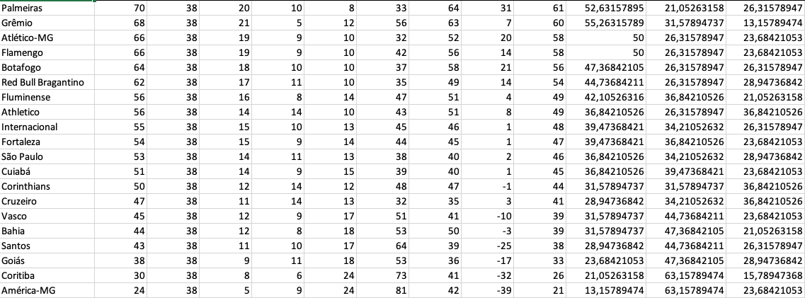
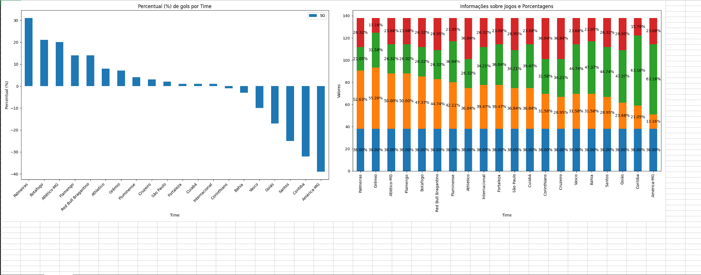

# Brasileirão Analysis

## Description
This Python project involves web scraping data from the Brazilian Football League (Brasileirão) website using BeautifulSoup and requests. The script processes team statistics, such as points, matches played, victories, defeats, goals, and winning percentages. The data is analyzed with pandas, and the results are visualized through bar charts using matplotlib. The generated Excel file ('brasileirao.xlsx') includes detailed team statistics and two bar charts illustrating goal percentages and match-related information. The project offers a concise analysis of team performance in the Brazilian Football League.

## Prerequisites
- Python 3.11
- Python libraries (installed via pip install -r requirements.txt)

## Installation

1. **Clone this repository:**

   ```bash
   git clone https://github.com/guibedan/covid-data.git
   cd brasileiraoAnalysis
   ```
2. **Install the dependencies:**

   ```bash
   pip install -r requirements.txt
   ```

## Execution

1. **Run the main script:**

   ```bash
   python main.py
   ```

## Results

1. **Excel file with team statistics:**


<br>

2. **Bar charts with team statistics:**
